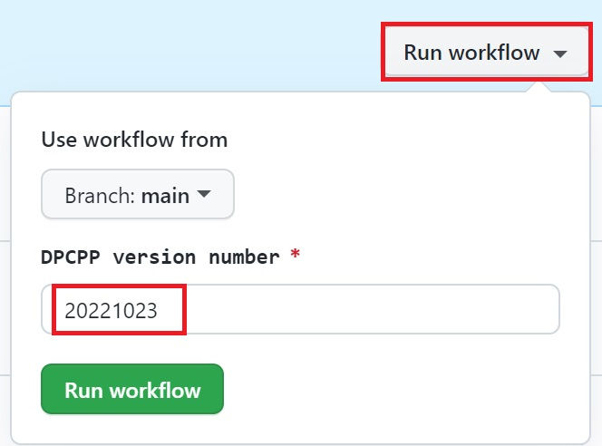

# DPCPP Daily Regression Tests
Under GitHub Actions, DPCPP regression test runs at 3PM (UTC) every day. It pulls yesterday's DPCPP from and runs the unit tests.

## Logs
You can check detailed logs under each test run/job or download the logs from the "Artifacts" section. Logs will only be retained for 7 days

## Job re-run v.s. manual re-run 
Under each test job, you can re-run the test by clicking the "Re-run jobs" button at the upper right corner. It gets DPCPP version number based on the date of yesterday, not from the old test job.

To run the test with a particular DPCPP version, you need to:
1. Go to "DPCPP Daily Regression Test" workflow
2. Click "Run workflow" and enter a DPCPP version number
